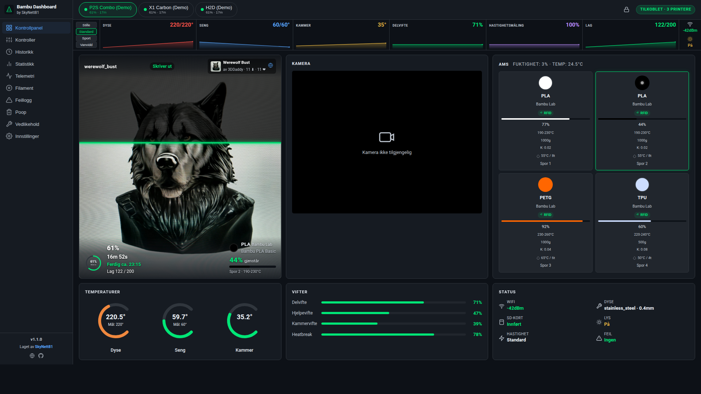

# Bambu Dashboard

> Self-hosted web dashboard for monitoring and controlling Bambu Lab 3D printers over your local network.

Created by **SkyNett81** &bull; [AGPL-3.0 License](LICENSE)

[](https://ko-fi.com/V7V21NRKM7)



---

## Highlights

- **Real-time monitoring** — live temperature gauges, sparkline graphs, print progress, 3D model preview
- **Multi-printer** — manage all your printers from one dashboard with instant switching
- **Print Guard** — automatic protection using xcam + 5 sensor monitors (temp, filament, fan, stall, errors)
- **Print Queue** — multi-printer dispatch with load balancing and pre-print filament checks
- **Filament Inventory** — favorites, color filters, bulk add, HueForge TD, CSV import, Spoolman sync
- **Cloud Slicer** — upload files, auto-slice with OrcaSlicer/PrusaSlicer, FTPS to printer
- **7 notification channels** — Telegram, Discord, Email, Webhook, ntfy, Pushover, SMS
- **17 languages** — Norwegian, English, German, French, Spanish, Italian, Japanese, Korean, Dutch, Polish, Portuguese (BR), Swedish, Turkish, Ukrainian, Chinese, Czech, Hungarian
- **Docusaurus documentation** — 82 pages in 17 languages, available at `/docs/` and on GitHub Pages
- **Zero frameworks** — pure HTML/CSS/JS frontend, Node.js 22 backend with 3 npm packages

---

## Requirements

| Requirement | Version | Required | Notes |
|-------------|---------|----------|-------|
| **Node.js** | 22.0+ | Yes | Uses built-in SQLite via `--experimental-sqlite` |
| **npm** | Included with Node.js | Yes | Package manager |
| **ffmpeg** | Any recent version | No | Only needed for camera livestream |
| **git** | Any recent version | No | For cloning, auto-updates, and version control |
| **openssl** | Any recent version | No | For auto-SSL certificate generation (usually pre-installed) |

## Supported Printers

All Bambu Lab printers with LAN mode enabled:

- **P1 Series** — P1S, P1S Combo, P1P
- **P2 Series** — P2S, P2S Combo
- **X1 Series** — X1 Carbon, X1 Carbon Combo, X1E
- **A1 Series** — A1, A1 Combo, A1 Mini
- **H2 Series** — H2S, H2D, H2C (toolchanger)

## Supported Platforms

| Platform | Support |
|----------|---------|
| Linux (Ubuntu, Debian, Fedora, etc.) | Full support |
| macOS | Full support |
| Windows | Works with Node.js, no install script |
| Docker | Full support (`network_mode: host` required) |
| Pterodactyl / wisp.gg | Egg file included |

---

## Quick Start

For a detailed step-by-step guide, see **[INSTALL.md](INSTALL.md)**.

### Option 1: Install Script (Recommended)

```bash
git clone https://github.com/skynett81/bambu-dashboard.git
cd bambu-dashboard
./install.sh
```

This will:
1. Check/install Node.js 22+
2. Install npm dependencies
3. Launch a web-based setup wizard where you add your printers

The setup wizard runs at `http://<your-ip>:3000` — open it in your browser to complete setup.

For a terminal-based install instead:
```bash
./install.sh --cli
```

### Option 2: Manual Install

```bash
git clone https://github.com/skynett81/bambu-dashboard.git
cd bambu-dashboard
npm install
cp config.example.json config.json
```

Edit `config.json` with your printer details (see [Configuration](#configuration)), then:

```bash
npm start
```

Open `https://localhost:3443` in your browser (HTTP on port 3000 redirects automatically).

### Option 3: Docker

```bash
git clone https://github.com/skynett81/bambu-dashboard.git
cd bambu-dashboard
cp config.example.json config.json
# Edit config.json with your printer details
docker compose up -d
```

> **Important:** `network_mode: host` is required for LAN access to printers via MQTT (port 8883) and camera streams (port 322). This is already set in `docker-compose.yml`.

### Option 4: Demo Mode (No Hardware)

Try the dashboard without a real printer:

```bash
git clone https://github.com/skynett81/bambu-dashboard.git
cd bambu-dashboard
npm install
npm run demo
```

This starts 3 simulated printers (P2S Combo, X1 Carbon, H2D) with live print cycles, telemetry, AMS data, and seeded history.

---

## Configuration

Edit `config.json` (created from `config.example.json`):

```json
{
  "printers": [
    {
      "id": "my-printer",
      "name": "My P1S",
      "ip": "192.168.1.100",
      "serial": "01S00A000000000",
      "accessCode": "12345678",
      "model": "P1S"
    }
  ],
  "server": {
    "port": 3000,
    "httpsPort": 3443,
    "cameraWsPortStart": 9001,
    "forceHttps": true
  }
}
```

### Finding Your Printer Details

| Field | Where to Find |
|-------|--------------|
| `ip` | Printer screen: Settings > WiFi/Network > IP Address |
| `serial` | Printer screen: Settings > Device > Serial Number |
| `accessCode` | Printer screen: Settings > WiFi/Network > LAN Access Code |
| `model` | Your printer model (e.g., `P1S`, `P2S Combo`, `X1 Carbon`, `A1 Mini`, `H2D`) |

> **Tip:** Printers can also be added, edited, and deleted from the Settings tab in the dashboard — no restart required.

### Multiple Printers

Add more entries to the `printers` array. Each printer gets its own MQTT connection and camera stream (on consecutive ports starting from `cameraWsPortStart`).

---

## HTTPS

HTTPS is enabled by default. On first start, the server auto-generates a self-signed SSL certificate if none exists. HTTPS runs on port 3443, and HTTP traffic on port 3000 is automatically redirected.

To use your own certificate, place files in `certs/cert.pem` and `certs/key.pem`.

The server includes HSTS and CSP security headers. To disable forced HTTPS, set `"forceHttps": false` in config.json.

---

## Authentication

Authentication is **disabled by default**. Enable it to protect the dashboard:

```json
{
  "auth": {
    "enabled": true,
    "password": "your-password",
    "username": "admin",
    "sessionDurationHours": 24
  }
}
```

Or use environment variables (for Docker/Pterodactyl):
```bash
BAMBU_AUTH_PASSWORD=your-password BAMBU_AUTH_USERNAME=admin npm start
```

---

## Notifications

Configure in **Settings > Notifications** in the dashboard:

| Channel | Configuration |
|---------|--------------|
| Telegram | Bot token + chat ID |
| Discord | Webhook URL |
| Email | SMTP host, port, credentials |
| Webhook | Custom URL with headers |
| ntfy | Server URL + topic |
| Pushover | API token + user key |
| SMS | Twilio or generic HTTP gateway |

14 events available including print status, errors, maintenance, queue, and filament alerts. Quiet hours supported.

---

## Updating

The dashboard checks for updates automatically (every 6 hours). When a new version is available, a toast notification appears.

**From the dashboard:** Click "View details" on the toast or go to Settings > System > Update Now.

**Manual (git):**
```bash
git pull && npm install
# Restart the server
```

**Docker:**
```bash
docker compose pull && docker compose up -d
```

---

## Troubleshooting

| Problem | Solution |
|---------|----------|
| Printer not connecting | Verify IP (`ping`), access code, port 8883 open, same LAN |
| Camera not working | Install `ffmpeg`, verify camera enabled on printer |
| "experimental-sqlite" error | Update to Node.js 22+: `node -v` |
| Docker: printer not found | Ensure `network_mode: host` in docker-compose.yml |
| Port already in use | Change `server.port` in config.json or set `SERVER_PORT` env var |
| Dashboard blank after update | Clear browser cache (Ctrl+Shift+R) |

---

## More Documentation

- **[Features](docs/features.md)** — complete feature list
- **[Architecture](docs/architecture.md)** — stack, modules, components, project structure, systemd, Pterodactyl
- **[Changelog](docs/changelog.md)** — version history from v1.0.0 to v1.1.14
- **[Installation Guide](INSTALL.md)** — detailed step-by-step install instructions
- **[Docusaurus Docs](website/)** — full documentation site in 17 languages, served at `/docs/` from the dashboard and deployed to [GitHub Pages](https://skynett81.github.io/bambu-dashboard/)

---

## Contributing

1. Fork the repository
2. Create a feature branch: `git checkout -b my-feature`
3. Run in dev mode: `npm run dev`
4. Test with demo: `npm run demo`
5. Submit a pull request

---

## License

[AGPL-3.0](LICENSE) — SkyNett81
